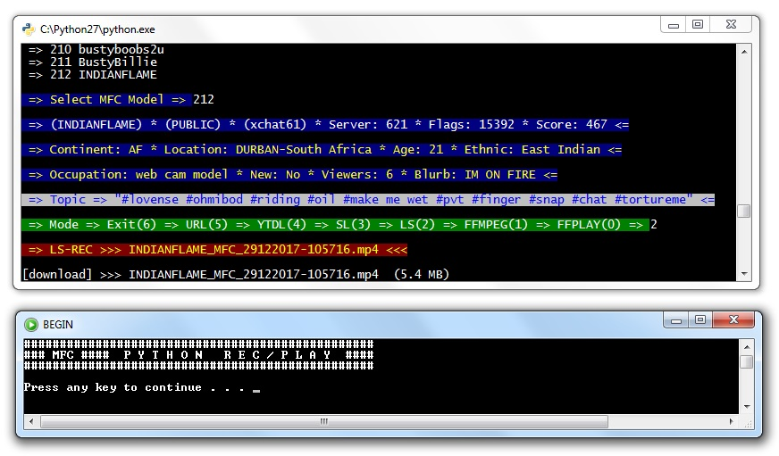
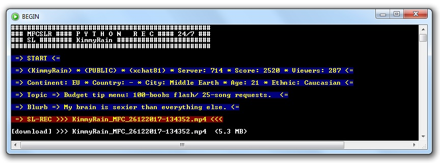
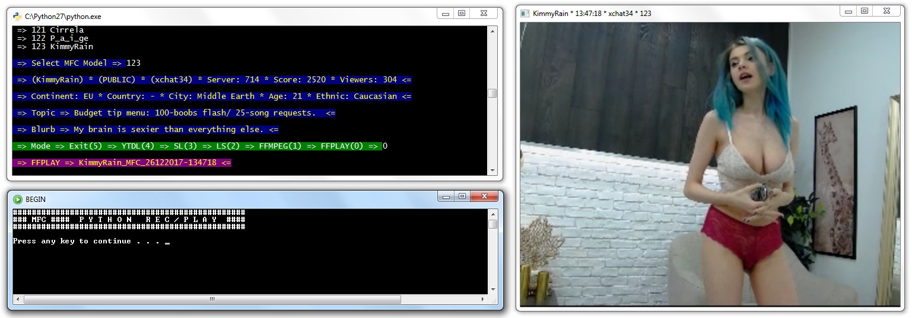

myfreecams-anonymous
====================
myfreecams-anonymous lets you follow and archive your selected MFC models shows on myfreecams.com.
You don't need to be registered myfreecams.com user for recording models with this myfreecams-anonymous script.

Requirements
============
1. Download here [Python 2.7.14](https://www.python.org/ftp/python/2.7.14/python-2.7.14.msi) instalation. Those who need to install python should watch this [video](https://www.youtube.com/watch?v=QYUBz4mrnFU)
2. Last version of [ffmpeg and ffplay](https://ffmpeg.zeranoe.com/builds/). Default location is C:/Windows, otherwise `config.cfg` must be edited.
3. Last version of [livestreamer](https://github.com/chrippa/livestreamer/releases) Default location is C:/Livestreamer/livestreamer.exe, otherwise `config.cfg` must be edited.
4. Last version of [streamlink](https://github.com/streamlink/streamlink). Default location is C:/Python27/Scripts/streamlink.exe, otherwise `config.cfg` must be edited.
5. Last version of [youtube-dl](http://rg3.github.io/youtube-dl/download.html). Default location is C:/Windows, otherwise `config.cfg` must be edited.

Setup
=====
1. Install requirements `pip install -r Requirements.txt` ... Try this for [urllib](https://www.versioneye.com/python/urllib/1.21.1)
2. Download and unpack the [code](https://codeload.github.com/horacio9a/myfreecams-anonymous/zip/master).
3. Open console and go into the directory where you unpacked the files (default is C:/-mfc-py/)
4. mfc.bat and MFC_Model.txt can be anywhere (default is C:/Windows/)
5. Edit `config.cfg` to your wish or accept default data.

Running & Output
================
These scripts I made in March 2017 and I see they work without problems today. In the meantime, I've changed a lot that you'll notice best during work with the script.
It's best to use 'Command Promt' first to install `Requirements.txt` and to try the basic multi mode `mfc.py` script. 
All four remote scripts are very similar and are based on the basic multi mode `mfc.py`.
It would be good to make a link for `mfc.bat` and put it in the task bar for easier startup. 
While using multi mode script `mfc.py` (options numbers 0) you can use the same script for start multiple models.
While using one of four remote scripts (options numbers 1 to 4) script executes the loop for only one certain model that allows continuous recording of that model (24/7) and can only be terminated with Ctrl-C.
If you want to permanent record (24/7) more than one model at the same time then you need to start multiple copies of some remote script.

