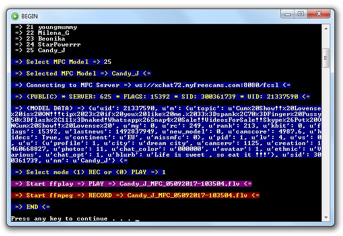
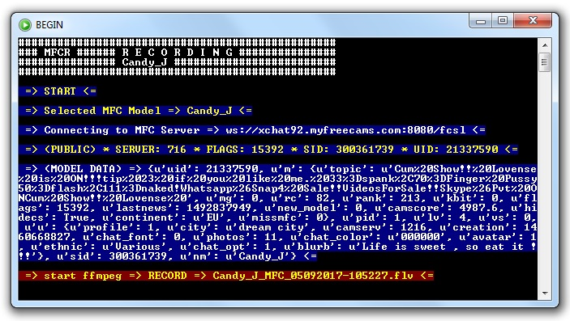

myfreecams-anonymous
====================
myfreecams-anonymous lets you follow and archive your selected models' shows on myfreecams.com.
So it does not favorites than selected models, which makes it easy to record specific models at a given time, not all the favorites that can be accumulated and too much for our disk free space;)
You don't need to be registered cam4 user for recording models with this myfreecams-anonymous script.

Requirements
============
1. Download here [Python 2.7.13](https://www.python.org/ftp/python/2.7.13/python-2.7.13.msi) instalation. Those who need to install python should watch this [video](https://www.youtube.com/watch?v=QYUBz4mrnFU)
3. [ffmpeg](https://ffmpeg.zeranoe.com/builds/) must be somewere in the path or in directory with this script.

Setup
=====
1. Install requirements `pip install -r Requirements.txt` ... Try this for [urllib](https://www.versioneye.com/python/urllib/1.21.1)
2. Download and unpack the [code](https://codeload.github.com/horacio9a/myfreecams-anonymous/zip/master).
3. Open console and go into the directory where you unpacked the files (default is C:/-mfc-py/)
4. mfc.bat can be anywhere (default is C:/Windows/)
5. Edit `config.cfg` to your wish or accept default data.

Running & Output
================
These scripts I made in March 2017 and I see they work without problems today.
Now I've added `config.cfg` and `mfc.bat` so it's now easier to use.
It's best to use 'Command Promt' first to install `Requirements.txt` and to try the basic `mfc.py` script. 
All four scripts are very similar and are based on the basic `mfc.py` which is most secure to use. 
If you use `mfc.bat` it would be good to make a link and put it in the task bar for easier startup. 
While using scripts `mfc.py` and `mfcts.py`(options numbers 0 and 1) you can the same copy of scripts can be used to start multiple models.
While using scripts `mfcr.py` and `mfcrts.py`(options numbers 2 and 3) a copy of the script executes the loop for only a certain model that allows continuous recording of that model (24/7) and can only be terminated with Ctrl-C.
If you want to record more than one model at the same time then you need to start another copy of `mfc.bat`. 
Otherwise for scripts `mfc.py` and `mfcts.py`(options numbers 0 and 1) I have deliberately predicted that each recording has its own ffmpeg and ffplay frame so you can easily stop recording or playing at any time if needed. 

